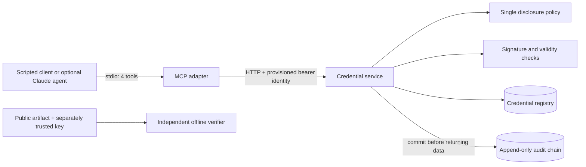

# CredentialGate

### Check the evidence behind a report before presenting it alongside an AI explanation.

**CredentialGate is a working synthetic-data prototype that lets an application check a report's registered provider connection through MCP, with access controls and an audit trail.**

Report Genie already explains uploaded reports. CredentialGate explores an additional question: *what evidence connects this exact document to a provider credential?* The original registered example passes its checks. A changed copy needs its own matching record; it does not inherit the original result.

The credential service owns the records, access decisions, signature checks and audit writes. Report Genie calls its narrow MCP tools and displays the result. It does not receive direct access to the credential database.

- **See the product story:** [Project overview and demonstration](docs/showcase.md).
- **Explore the design:** [Architecture and tradeoffs](docs/architecture.md).
- **Check the implementation:** [Authorization tests](tests/test_authorization.py), [signed-report tests](tests/test_report_binding.py), and [real MCP integration test](tests/test_mcp_integration.py).

**Scope:** independent personal prototype with synthetic providers and documents. It checks a configured issuer's signed records and the local registry's status. It does not prove medical accuracy, professional license validity or actual report authorship. General credential lifecycle management, issuer onboarding and institutional deployment are future work.

## What you can demonstrate

| Scenario | Observed behavior | What it illustrates |
|---|---|---|
| Registered original report | Signed association and active credential checks pass | Evidence can be inspected separately from an AI explanation |
| Changed report bytes | No matching registered association | A different file does not inherit the earlier result |
| Caller requests a forbidden field | Request denied without returning that field | The service enforces permissions, independent of a prompt |
| Audit insertion fails | No successful verification/disclosure result | The service refuses to return a successful result without committing its audit event |

The report examples have a guided browser walkthrough in the local Report Genie integration. Permission and audit-failure cases are demonstrated by executable tests. These are distinct demonstrations; the walkthrough does not impersonate institutional users or run a live language model.

## Run the complete browser demo

```bash
git clone https://github.com/rhea-19/credentialgate.git
cd credentialgate
python3 -m venv .venv
source .venv/bin/activate
python -m pip install -c requirements.lock -e '.[dev,web]'
python scripts/run_report_genie.py
```

Open **http://127.0.0.1:5002/walkthrough**. Choose **Original sample**, check it, then try **Changed copy**. The launcher starts both applications and initializes a separate synthetic fixture registry once. No cloud account or model weights are required. Stop both services with Ctrl+C. If ports are occupied, add `--port 5003 --api-port 8012`.

This GitHub repository is private, so cloning requires access. A localhost URL works only on the machine running the application. See the [presentation script](integrations/report-genie/docs/presenting-the-demo.md) for a two-minute walkthrough.

## Run only the credential service

Requires Python 3.11+; tested with Python 3.12. No cloud account or LLM key is needed for the deterministic MCP demo.

```bash
cd credentialgate
python3 -m venv .venv
source .venv/bin/activate
python -m pip install -c requirements.lock -e '.[dev]'
python -m credentialgate.bootstrap --data-dir var
python -m uvicorn credentialgate.service:app --host 127.0.0.1 --port 8010
```

Bootstrap runs **once** and refuses to overwrite an existing registry. If this folder is already initialized, skip bootstrap. Provider IDs and the audit chain survive service restarts. Tokens expire after 30 days; use a new data directory to create a fresh demo.

Open **http://127.0.0.1:8010/docs** for the interactive API documentation. The bundled [`integrations/report-genie`](integrations/report-genie) directory provides the guided browser walkthrough. The standalone Report Genie repository is separate and its public default branch has not been changed.

In another terminal, from the project directory:

```bash
source .venv/bin/activate
python scripts/demo.py --profile public
python scripts/demo.py --profile institution
python scripts/demo.py --profile reviewer
python scripts/check_audit.py
```

The demo launches the real MCP server over stdio, discovers its tools, and calls the HTTP service. It is a scripted client, not a simulated LLM conversation. The host-only launcher loads a selected token from `var/clients.json`; it does not read credential records. A model cannot choose a profile through a tool argument.

Expected results for `prov_demo_001`:

| Request | Public | Institution A | Reviewer A | Institution B |
|---|---|---|---|---|
| Public summary | Allowed | Allowed | Allowed | Denied: institution scope |
| Verify credential | Allowed | Allowed | Allowed | Denied: institution scope |
| License number | Denied | Allowed | Allowed | Denied |
| Date of birth | Denied | Denied | Allowed | Denied |

`prov_demo_002` belongs to Institution B. A scoped institution account stays within its institution, even for public-field operations. Public clients can access public fields across providers. Mixed requests containing any forbidden field are denied entirely.

## Architecture



- **Service:** owns identities, disclosure policy, database and audit writes. Tokens are stored as SHA-256 digests and map to a server-side role and institution. Client-supplied roles are rejected.
- **MCP adapter:** has a fixed API URL and one client token; no database configuration, file tools, signing tools, SQL tool or policy imports. Redirects are disabled; non-loopback HTTP requires an explicit development override.
- **Client:** knows the tool schemas, not the registry schema. The optional agent routes model tool calls through MCP with a bounded six-round loop.
- **Offline verifier:** checks the artifact without importing application signing/verification code. It uses the maintained `cryptography` library, rather than implementing its own cryptography.

The import-boundary test is a regression guard, not an OS sandbox. Local processes run as your user. Separate Docker targets provide a stronger filesystem boundary: the MCP image contains only adapter/client source and receives no database volume.

## MCP tools

| Tool | Inputs | Behavior |
|---|---|---|
| `get_provider_summary` | `provider_id` | Verified public metadata for an active credential |
| `verify_credential` | `provider_id` | Signature, issuer, identity, time validity and local registry status |
| `request_credential_fields` | `provider_id`, `fields` | Exactly the authorized requested fields, or a complete denial |
| `verify_report_binding` | `sha256` | A registered report association, credential version and active status; public metadata only |

Public fields: `display_name`, `profession`, `jurisdiction`. Institution fields additionally include `license_number`, `institution`, `license_expires_at`. A reviewer in the same institution can also request `contact_email`, `date_of_birth`.

The API exposes `POST /v1/summary`, `/v1/verify`, `/v1/fields`, and `/v1/reports/verify`. Credential responses have a request ID matching the audit event and `Cache-Control: no-store`. Denied and missing scoped records return the same generic denial. Failed verification returns a status without credential fields.

## What is signed?

Each artifact has an Ed25519 signature over the **exact UTF-8 payload bytes**, carried as base64. The payload binds provider ID, credential ID, issuer, schema, validity window and public metadata. Verifiers require a separately configured trust bundle and an expected provider ID; a key embedded in an untrusted artifact cannot establish trust.

Restricted fields are absent from this artifact. They are authorized registry assertions, **not independently signed disclosures**. Field filtering is application authorization, not cryptographic selective disclosure or a zero-knowledge proof. No JCS, JWT, DID or W3C VC compatibility is claimed.

```bash
python tools/verify_artifact.py var/prov_demo_001.credential.json \
  --trust var/trust.json --provider prov_demo_001
```

Offline verification checks signature, identity and time validity, but cannot establish current revocation or real-world qualifications. Online verification also checks the registry's `active`, `revoked` or `unknown` status. The fixture signing key is generated once and discarded; the running service cannot issue new credentials.

## Audit behavior

Access decisions and audit inserts share a serialized SQLite transaction. Each event records actor, operation, provider ID, outcome, timestamp, request ID and a hash link to the previous event. Tokens and returned field values are excluded. Database triggers reject updates/deletes. An audit insert or commit failure returns a generic `503` with **no credential data**.

Invalid identities, denied requests and schema-validation failures are audited when storage is available. Database outages deny the operation without recording an event. Health checks, API docs and unrelated HTTP routing errors are not credential-access events.

This is **not immutable against a database administrator**: they can drop triggers, rewrite the chain or remove a suffix. External checkpoints or an independent append-only store are needed for those threats. The checker detects changed content against the stored chain, not every administrator attack. SQLite serialization also limits throughput.

## Optional Claude client

The scripted demo needs no external model. To try the Claude tool-use loop:

```bash
python -m pip install -c requirements.lock -e '.[agent]'
export ANTHROPIC_API_KEY='your-key'
export ANTHROPIC_MODEL='a-model-id-available-in-your-account'
python scripts/demo.py --profile public --question \
  'Verify prov_demo_001, summarize it, and tell me whether you can retrieve its date of birth.'
```

This sends questions and tool results to the model provider and may incur API charges. Use synthetic fixtures only. Automated end-to-end tests exercise the real MCP transport without paid model calls; live model behavior requires a separate run with your API key.

For another MCP host, use `.venv/bin/python -m credentialgate.mcp_server` with `CREDENTIALGATE_API_URL` and a provisioned `CREDENTIALGATE_API_TOKEN` in its environment. Do not commit tokens. Static development tokens are not remote MCP OAuth authorization.

## Tests and delivery

```bash
python -m pytest -q
ruff check .
ruff format --check .
```

Tests cover role/tenant scope, all-or-nothing disclosure, rejected role overrides, expired identities, revocation, unknown status, modified artifacts, issuer/identity mismatches, expiry, future validity, audit failures, append-only enforcement, concurrent access and real MCP-to-HTTP integration. Negative controls deliberately introduce tampering or forbidden imports to establish that guards detect broken conditions.

`requirements.lock` records tested dependency versions as pip constraints; it is not a hash-verified supply-chain lock. GitHub Actions runs tests/lint and builds both Docker targets when this is placed in its own repository. Docker must be installed to run containers locally.

```bash
docker build --target api -t credentialgate-api .
docker build --target mcp -t credentialgate-mcp .
```

See [architecture decisions and roadmap](docs/architecture.md) for deployment boundaries and next steps.

## Source map

```text
src/credentialgate/
  service.py       HTTP API and audit-before-response transaction
  policy.py        Role and institution disclosure rules
  crypto.py        Signing and online verification
  storage.py       Schema, audit triggers and chain checker
  bootstrap.py     Synthetic providers and demo identities
  mcp_server.py    Four MCP tools; HTTP access only
  client.py        Scripted client and optional Claude loop
tools/verify_artifact.py   Independent offline verifier
scripts/                  Demo launcher and operator audit checker
tests/                    Authorization, integrity, boundary and MCP tests
```

## Report Genie integration

Report Genie now fingerprints uploaded PDF bytes on its server and calls `verify_report_binding` through a real MCP client. The website displays report association, signed credential metadata, registry status and an audit reference as separate evidence. It does not read this service's database or receive private credential fields.

A local operator must explicitly attest an association first:

```bash
python -m credentialgate.bind_report /path/to/synthetic.pdf --provider prov_demo_001 --data-dir var
```

The command applies the additive report-bindings schema migration, signs a digest/provider/credential-ID association, stores the attestor public key and discards the ephemeral private key. This is a trusted local operator action, not an MCP tool or a public issuance endpoint. It expires after at most 30 days; re-running the command does not renew it. General provider issuance and renewal remain future work.

Unknown report bytes are unregistered, not automatically fraudulent. An association attests only to what the operator registered; it does not establish provider authorship, license validity or clinical accuracy. No report text is sent to this service. Report Genie's browser connector uses a public service identity, not end-user institutional delegation.

The bundled `integrations/report-genie` application includes a guided walkthrough and a two-service preview. Use `scripts/run_report_genie.py` from this repository root. The synthetic preview uses real MCP/HTTP/signature/audit operations while model extraction and Q&A are explicitly disabled. The original model pipeline requires its own dependencies and account configuration.

The broader lifecycle, approvals and deployment plan remains in `docs/project-review-and-roadmap.md`. The report-association integration is now implemented; the complete six-stage platform is not.
