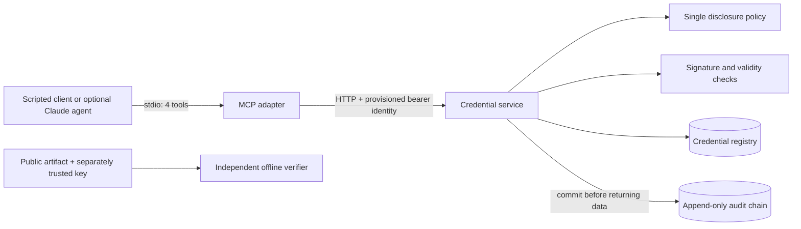

# CredentialGate

[](https://github.com/rhea-19/credentialgate/actions/workflows/ci.yml)

### MCP-based evidence verification and scoped access for AI-facing healthcare document workflows.

**CredentialGate is a working synthetic-data prototype that extends [Report Genie](https://github.com/rhea-19/Report-Genie) with a separate credential and evidence service.**

Report Genie focuses on explaining medical reports. CredentialGate explores the layer underneath that workflow: before an AI-facing application presents evidence, what can it verify about the exact report bytes, the provider credential they are associated with, and the caller's permission to access related data?

The credential service owns identities, records, disclosure policy, signature checks and audit writes. Report Genie interacts through four narrow MCP tools rather than receiving direct access to the credential database.

- **Project story:** [docs/showcase.md](docs/showcase.md)
- **Architecture and tradeoffs:** [docs/architecture.md](docs/architecture.md)
- **Authorization tests:** [tests/test_authorization.py](tests/test_authorization.py)
- **Signed-report tests:** [tests/test_report_binding.py](tests/test_report_binding.py)
- **Real MCP integration test:** [tests/test_mcp_integration.py](tests/test_mcp_integration.py)

> **Scope:** this is an independent personal prototype using synthetic providers and reports. It verifies configured signed records and local registry state. It does **not** prove medical accuracy, real-world professional license validity, report authorship, HIPAA compliance, or institutional deployment readiness.

## Why this project

Grounding an LLM answer in retrieved text solves only part of the trust problem. An application may still be implicitly trusting the underlying document, the identity attached to it, or the caller's claimed role.

CredentialGate explores three boundaries explicitly:

1. **Evidence integrity:** changed report bytes do not inherit the verification result of an earlier registered file.
2. **Authorization:** the model cannot choose a stronger role through tool arguments; identity and disclosure policy are resolved by the service.
3. **Audit-before-response:** a successful verification or disclosure is not returned unless the corresponding audit event commits successfully.

## What you can demonstrate

| Scenario | Observed behavior | What it illustrates |
|---|---|---|
| Registered original report | Signed association and active credential checks pass | Evidence can be inspected separately from an AI explanation |
| Changed report bytes | No matching registered association | A different file does not inherit the earlier result |
| Caller requests a forbidden field | Request denied without returning that field | Permissions are enforced by the service, independent of a prompt |
| Role is supplied in a tool request | Request is rejected | The model/client cannot self-assign authorization |
| Audit insertion fails | No successful verification/disclosure result | The service fails closed when it cannot record the access decision |
| Artifact/signature is modified | Verification fails | Signed bytes and configured issuer trust are checked before use |

The browser walkthrough focuses on the report-evidence path. Permission, tampering and audit-failure cases are demonstrated through executable tests.

## Architecture



### Boundary design

- **Credential service:** owns identities, disclosure policy, database access, signature checks and audit writes.
- **MCP adapter:** exposes only four read-oriented tools. It has no database configuration, SQL tool, signing key, disclosure policy import, or caller-controlled role parameter.
- **Client:** knows MCP tool schemas, not the credential database schema.
- **Independent verifier:** checks exported artifacts without importing CredentialGate's application verification helper.
- **Docker boundary:** the MCP image contains only adapter/client source and receives no credential database volume.

The import-boundary test is a regression guard, not an operating-system sandbox. Local processes still share the privileges of the host user.

## MCP tools

| Tool | Inputs | Behavior |
|---|---|---|
| `get_provider_summary` | `provider_id` | Returns verified public metadata for an active credential |
| `verify_credential` | `provider_id` | Checks signature, trusted issuer, identity, time validity and local registry status |
| `request_credential_fields` | `provider_id`, `fields` | Returns exactly the authorized requested fields or a complete denial |
| `verify_report_binding` | `sha256` | Checks a registered report/provider/credential association and current credential state |

MCP standardizes tool discovery and invocation here; **it is not the authorization mechanism**. Authorization remains in the HTTP credential service behind the adapter.

## Disclosure model

Public fields:

- `display_name`
- `profession`
- `jurisdiction`

Institution-scoped fields additionally include:

- `license_number`
- `institution`
- `license_expires_at`

A same-institution reviewer may additionally request:

- `contact_email`
- `date_of_birth`

The role comes from the provisioned service identity, not from a model/tool argument. Cross-institution requests are denied, and mixed requests containing any forbidden field fail as a whole.

## What is signed?

Credential artifacts use **Ed25519** over the exact UTF-8 payload bytes. The signed payload binds:

- provider ID
- credential ID
- issuer
- schema
- issued/expiry timestamps
- public metadata

Verifiers require a separately configured trust bundle and an expected provider ID. A key embedded in an untrusted artifact cannot establish trust by itself.

Restricted fields are intentionally absent from the public artifact. They are registry assertions protected by authorization, **not cryptographic selective disclosure**. This prototype does not claim JCS, JWT, DID, zero-knowledge proof, or W3C Verifiable Credential compatibility.

Offline verification checks signature, identity, issuer trust and time validity, but cannot determine live revocation or real-world qualifications. Online verification additionally checks the registry's `active`, `revoked` or `unknown` status.

## Report Genie integration

The bundled Report Genie integration fingerprints the exact PDF bytes on the server and calls `verify_report_binding` through a real MCP client.

A local operator can register a signed synthetic association between:

- the report's SHA-256 digest
- provider ID
- credential ID/version
- synthetic attesting issuer

```bash
python -m credentialgate.bind_report /path/to/synthetic.pdf \
  --provider prov_demo_001 \
  --data-dir var
```

Changing even one byte produces a different digest and therefore does not inherit the original association. The correct result for an unknown copy is **unregistered / connection not established**, not an unsupported claim that the document is fraudulent.

The association proves only what the configured synthetic operator registered. It does not establish provider authorship, professional license validity or medical accuracy.

## Run the complete browser demo

```bash
git clone https://github.com/rhea-19/credentialgate.git
cd credentialgate
python3 -m venv .venv
source .venv/bin/activate
python -m pip install -c requirements.lock -e '.[dev,web]'
python scripts/run_report_genie.py
```

Open **http://127.0.0.1:5002/walkthrough** and compare **Original sample** with **Changed copy**. The launcher starts both local services and initializes an isolated synthetic fixture registry. No cloud account or model weights are required for this deterministic walkthrough.

A localhost URL is reachable only from the machine running the demo. If the default ports are busy, use `--port 5003 --api-port 8012`.

## Run only the credential service

Requires Python 3.11+; CI currently uses Python 3.12.

```bash
cd credentialgate
python3 -m venv .venv
source .venv/bin/activate
python -m pip install -c requirements.lock -e '.[dev]'
python -m credentialgate.bootstrap --data-dir var
python -m uvicorn credentialgate.service:app --host 127.0.0.1 --port 8010
```

Bootstrap runs once and refuses to overwrite an existing registry. Provider IDs and the audit chain survive service restarts. Demo tokens expire after 30 days; initialize a new data directory to create fresh fixture identities.

Open **http://127.0.0.1:8010/docs** for FastAPI's interactive API documentation.

In another terminal:

```bash
source .venv/bin/activate
python scripts/demo.py --profile public
python scripts/demo.py --profile institution
python scripts/demo.py --profile reviewer
python scripts/check_audit.py
```

The scripted demo launches the real stdio MCP server, discovers its tools, and calls the HTTP service. The host-side launcher selects a provisioned token; a model cannot choose a profile through a tool argument.

## Audit behavior

Access decisions and audit inserts share a serialized SQLite transaction. Each event stores:

- actor
- operation
- provider ID
- outcome
- timestamp
- request ID
- hash link to the previous event

Tokens and returned field values are excluded. Database triggers reject update/delete operations on audit rows. If audit insertion or transaction commit fails, the service returns a generic `503` and no credential data.

The chain is **not administrator-proof**. A database administrator can remove triggers, rewrite history or truncate a suffix. External checkpoints or an independently retained append-only store would be needed for that threat model.

## Independent verification

Exported artifacts can be checked separately from the running credential service:

```bash
python tools/verify_artifact.py \
  var/prov_demo_001.credential.json \
  --trust var/trust.json \
  --provider prov_demo_001
```

The verifier does not import CredentialGate's application package. It uses the maintained `cryptography` library and independently implements the expected artifact checks.

## Optional Claude client

The deterministic demo needs no model account. An optional tool-use loop can let Claude discover and call the same MCP tools:

```bash
python -m pip install -c requirements.lock -e '.[agent]'
export ANTHROPIC_API_KEY='your-key'
export ANTHROPIC_MODEL='a-model-id-available-in-your-account'
python scripts/demo.py --profile public --question \
  'Verify prov_demo_001, summarize it, and tell me whether you can retrieve its date of birth.'
```

Only synthetic fixture data should be used. Live model behavior is separate from the deterministic protocol/integration tests.

## Tests and delivery

```bash
python -m pytest -q
ruff check .
ruff format --check .
```

Tests cover:

- role and institution scope
- all-or-nothing disclosure
- rejected role overrides
- expired identities
- revoked/unknown credentials
- modified artifacts
- issuer and identity mismatches
- future/expired validity windows
- report-digest and provider-association tampering
- audit failure and chain integrity
- concurrent access
- executable import boundaries
- real stdio MCP-to-HTTP integration

GitHub Actions runs the test/lint suite and builds both Docker targets. The container job also verifies that the MCP image does not contain the credential service/storage modules.

```bash
docker build --target api -t credentialgate-api .
docker build --target mcp -t credentialgate-mcp .
```

## Current limitations and next steps

This repository is intentionally a **prototype**, not a production credential platform. Important future work includes:

- authenticated issuance, renewal, revocation and key rotation
- issuer onboarding and trust management
- stronger deployment identities and short-lived credentials
- externally retained audit checkpoints
- production database/migrations and operational controls
- bounded human-approved disclosure workflows
- measured live-agent evaluations

See [docs/architecture.md](docs/architecture.md) and [docs/project-review-and-roadmap.md](docs/project-review-and-roadmap.md) for the longer design discussion.

## Source map

```text
src/credentialgate/
  service.py       HTTP API and audit-before-response transaction
  policy.py        Role and institution disclosure rules
  crypto.py        Signing and online verification
  storage.py       Registry schema, audit triggers and chain checker
  bootstrap.py     Synthetic providers and provisioned demo identities
  bind_report.py   Local synthetic report/provider attestation command
  reports.py       Report-binding verification logic
  mcp_server.py    Four MCP tools; HTTP access only
  client.py        Scripted client and optional Claude loop

tools/
  verify_artifact.py   Independent offline verifier

scripts/                 Demo launchers and audit utilities
tests/                   Authorization, integrity, boundary and MCP tests
integrations/report-genie/  Guided two-service browser walkthrough
```

---

**Related project:** [Report Genie — healthcare document intelligence and grounded report Q&A](https://github.com/rhea-19/Report-Genie)
