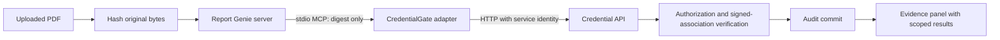

> Bundled checkout: the simplest setup is the repository-root command `python scripts/run_report_genie.py`. See [the integration README](../README.md).

# Report evidence through MCP

This integration adds an independent report-provenance check to Report Genie. It uses synthetic fixtures and the separate CredentialGate service. Report interpretation and credential evidence remain separate results.

## What is implemented

- The server hashes the exact uploaded PDF bytes with SHA-256.
- The browser asks to check its current session's report; it cannot choose a provider, token, role or alternate digest for that check.
- A real MCP client launches the configured CredentialGate stdio adapter and calls `verify_report_binding`.
- CredentialGate validates a separately registered signed association, issuer trust, caller scope, credential version, signature/time and live registry status.
- The credential service records an audit event before returning a result. Failures never produce a verified badge.
- The UI shows individual checks, public provider information where permitted, and an audit reference. License validity and medical accuracy are explicitly not evaluated.
- Upload summaries are stored per session, expire after 24 hours and are no longer read from a shared `extracted.json`. Expired rows are removed on a later upload; no background deletion guarantee is made. Temporary PDFs are removed even if extraction fails.



No report text, patient fields or model prompt is sent to CredentialGate. A digest is still a stable identifier; keep this demo synthetic. The current public website connector uses one provisioned public service identity, not delegated end-user institutional access.

## Run the complete local demo

The integration requires Python 3.11 or newer.

In the CredentialGate directory, set up its Python environment following its README. Then, in Report Genie:

```bash
python3 -m venv .venv-mcp
source .venv-mcp/bin/activate
python -m pip install -r requirements-integration.txt
python scripts/run_evidence_demo.py --credentialgate "/path/to/credentialgate"
```

Open **http://127.0.0.1:5002** and choose **Explore the registered sample**, then **Check report evidence**. The service runs at port 8011. Ctrl+C stops both services.

The launcher creates a separate `var/report-genie-demo` fixture registry in CredentialGate, registers only the bundled synthetic PDF using a local operator command, and provisions its public client token to the web server. It does not register arbitrary uploads. The preview's summary and Q&A are explicitly fixture-only; MCP, HTTP, signature verification and auditing are real. No Gemini key or local language model is needed for this preview.

Download the synthetic PDF, change its bytes, and upload the changed copy. It should show **No association found**, not a verified provider. A changed, unknown file cannot automatically be labeled fraudulent; there is no trusted association to compare it against.

## Original model-backed mode

The original extraction/retrieval/generation modules are preserved and imported when used. Running without `REPORTGENIE_DEMO=1` uses them and requires their original dependencies, Gemini account configuration and model weights. The full AI stack has not been retested as part of this integration; its older model/API pins may require a separate update.

For the integration, the web environment needs the `mcp` package. Configure these on the **server**, never in browser JavaScript:

```text
CREDENTIALGATE_MCP_PYTHON=/absolute/path/to/credentialgate/.venv/bin/python
CREDENTIALGATE_API_URL=http://127.0.0.1:8011
CREDENTIALGATE_API_TOKEN=<provisioned public client token>
REPORTGENIE_SECRET_KEY=<stable random secret for signed sessions>
REPORTGENIE_DATA_DIR=/private/writable/location
```

The MCP subprocess uses its own environment and does not receive Gemini credentials. Report Genie neither imports credential policy/database code nor holds signing keys. Both requirement files now use Flask 3.1.3 and MCP 1.30.0. Before public deployment, reconcile and retest the original AI dependency stack, configure persistent session secrets, secure cookies/TLS, rate limiting and process supervision. This change is a local integration, not a deployed production upgrade.

## Association semantics

An operator with local registry access explicitly associates a synthetic report digest with a provider credential:

```bash
python -m credentialgate.bind_report /path/to/synthetic.pdf \
  --provider prov_demo_001 --data-dir var/report-genie-demo
```

The command uses an ephemeral Ed25519 key, records its trusted public key and signed association in one transaction, then discards the private key. Existing associations cannot silently be reassigned to a different provider. Trust in this prototype ultimately comes from the local operator; there is no accredited issuer onboarding or public issuance API. The association expires after at most 30 days and is tied to the credential ID. Running the command again does not renew it.

A passing check means a configured attestor registered these exact bytes against that synthetic credential. It does not establish provider authorship, clinical correctness, license validity, or the trustworthiness of the model's interpretation. This gives the project an independent purpose: inspect evidence accompanying AI report explanations.

## Verification

```bash
python -m pytest -q tests
```

Report Genie tests cover session isolation, server-selected digests, CSRF, upload handling, failures, public-field filtering and the preserved extraction call. CredentialGate tests cover the signed association, digest/provider/signature tampering, revocation, tenant denial and audit failures. A separate local end-to-end run exercises browser → Flask → MCP → HTTP → audit; live AI generation is not part of that run.
